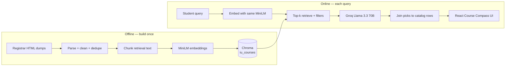

# IU Course Compass

**Semantic course discovery for Indiana University Bloomington.**

Students describe what they want to learn in plain English. The app searches a vector index of the official Schedule of Classes, then a Groq LLM writes advisor-style explanations — only from those retrieved catalog rows.

[](https://www.python.org/)
[](https://fastapi.tiangolo.com/)
[](https://react.dev/)
[](https://www.trychroma.com/)
[](https://console.groq.com/)

> Not an official IU advising tool. Catalog data comes from public Registrar research dumps. Always confirm sections, seats, and prerequisites in [One.IU](https://one.iu.edu/) before registering.

---

## The problem

Keyword search fails when a student says *“I want Python, machine learning, and real-world data work”*. The catalog does not always use those words. Course codes, topic titles, and department names scatter related classes across CSCI, STAT, ILS, INFO, and more.

**Course Compass treats advising as a RAG problem:** retrieve real IU courses first, then generate an explanation. The model never invents a course code.

---

## What it does

- Natural-language search over ~12,000 unique IUB courses (Spring 2026, Fall 2025, Summer 2025)
- Local MiniLM embeddings + Chroma similarity search
- Optional filters: term, department, undergraduate / graduate
- Groq `llama-3.3-70b-versatile` returns a short advisor summary plus 3–6 picks
- Each card shows match score, credits, meetings, instructors, prerequisites, and a grounded “why”
- IU crimson / cream UI (Vite + React + Tailwind)

Example query:

> I am interested in machine learning and data engineering and I want courses that involve Python and real world applications.

---

## Architecture

Two pipelines share one catalog. **Offline** builds the index. **Online** answers a student.



```
frontend (Vite :5173)  --proxy /api-->  FastAPI (:8000)
                                              |
                         retrieve  <----  Chroma + courses.json
                                              |
                         generate  ---->  Groq chat API
```

| Layer | Choice | Why |
| --- | --- | --- |
| Source of truth | IU Registrar SoC HTML (`soc*fac.html`) | Public, no CAS login. Excel dumps for newer terms are login-walled. |
| Parsing | BeautifulSoup + regex over PRE/H3 dumps | Recovers code, title, credits, meetings, instructors, prereqs |
| Embeddings | `all-MiniLM-L6-v2` via Chroma ONNX | Groq keys typically have **no** embedding models. Same function indexes and queries. |
| Vector store | Chroma (`chroma/`, collection `iu_courses`) | Local, persistent, metadata filters |
| LLM | Groq `llama-3.3-70b-versatile` | Fast JSON explanations over retrieved rows only |
| API | FastAPI | `/api/recommend`, `/api/meta`, `/health` |
| UI | React + Tailwind | Search, filters, recommendation cards |

---

## How it works

### 1. Ingest — public catalog → structured JSON

`python -m pipeline.ingest`

1. Download (or reuse cached) research HTML from  
   `https://utilities.registrar.indiana.edu/course-browser/browser/research/soc{term}fac.html`
2. Skip terms that 404 or bounce to login (currently Fall 2026 and Summer 2026).
3. Parse each course header, section meetings, notes, and prerequisite lines.
4. Dedupe by `(term, course_code, title)` so lecture + lab rows become one searchable course.
5. Build `retrieval_text`: title, description, department, level, credits, prereqs, meetings, instructors — the string that actually gets embedded.
6. Write `data/processed/courses.json`.

### 2. Embed — chunks → Chroma

`python -m pipeline.embed`

1. Split long `retrieval_text` into ~1600-character chunks with overlap (short courses stay one chunk).
2. Embed in batches with the same MiniLM model used at query time.
3. Store vectors plus metadata (`term`, `department`, `level`, `course_code`, …) in Chroma.
4. First run downloads the ONNX MiniLM weights; later runs reuse `chroma/`.

Index artifacts (`data/raw/`, `data/processed/`, `chroma/`) are gitignored. Clone the repo, then run ingest + embed locally.

### 3. Retrieve — meaning, not keywords

`POST /api/recommend`

1. Embed the student query with **the same MiniLM model**.
2. Query Chroma for top-k (default 12) nearest neighbors.
3. Apply optional metadata filters: term, department, level.
4. Convert cosine distance → a 0–1 match score: `1 - distance`.
5. Hydrate each hit from `courses.json` so the UI gets full meetings, instructors, and descriptions.

A query about “neural nets and Python projects” can surface `CSCI-B 455` even if the student never typed the course code.

### 4. Generate — explain, don’t invent

The LLM is an advisor, not a catalog.

- System prompt: use **only** the retrieved records. Never invent codes, titles, prereqs, times, or credits.
- Temperature `0.2`, `response_format: json_object`.
- Output shape: `{ summary, picks: [{ code, term, reason }] }`.

After Groq returns, the API **maps every pick back onto retrieved rows**. Unknown codes are dropped. If JSON is empty or malformed, the API falls back to the top retrieved courses with a generic grounded note. The UI never shows a hallucinated class.

```
Student query
    → MiniLM vector
    → Chroma top-12 (+ filters)
    → compact JSON sent to Groq
    → picks joined to real catalog rows
    → 3–6 cards + advisor summary
```

---

## Project layout

```
├── pipeline/
│   ├── ingest.py          # download + parse + dedupe
│   ├── parse_soc.py       # SoC HTML parser
│   ├── embed.py           # chunk + MiniLM + Chroma write
│   ├── embeddings.py      # shared embedding function
│   ├── llm.py             # Groq client, retries, model names
│   └── config.py          # terms, paths, collection name
├── backend/
│   ├── app.py             # FastAPI routes
│   └── rag.py             # retrieve → generate → ground
├── frontend/              # Vite + React + Tailwind UI
├── data/raw/              # cached HTML (gitignored)
├── data/processed/        # courses.json (gitignored)
├── chroma/                # vector index (gitignored)
├── .env.example
└── requirements.txt
```

---

## Quick start

**Requirements:** Python 3.11+, Node 18+, a [Groq API key](https://console.groq.com/keys).

```bash
git clone https://github.com/bhanuaravind9549/AI-Course-Predcitor.git
cd AI-Course-Predcitor
python -m venv .venv
```

Windows PowerShell:

```powershell
.\.venv\Scripts\Activate.ps1
pip install -r requirements.txt
copy .env.example .env
```

macOS / Linux:

```bash
source .venv/bin/activate
pip install -r requirements.txt
cp .env.example .env
```

Put your key in `.env`:

```env
GROQ_API_KEY=gsk_your-key-here
GROQ_CHAT_MODEL=llama-3.3-70b-versatile
EMBEDDING_MODEL=all-MiniLM-L6-v2
```

Build the catalog and index (once; ingest hits the network, embed is local CPU):

```bash
python -m pipeline.ingest
python -m pipeline.embed
```

API (leave this running):

```bash
uvicorn backend.app:app --host 127.0.0.1 --port 8000
```

Avoid `--reload` while the index lives under the project folder — the file watcher can interrupt Chroma. Use reload only when iterating on API code.

UI:

```bash
cd frontend
npm install
npm run dev
```

Open [http://localhost:5173](http://localhost:5173). Vite proxies `/api` and `/health` to the FastAPI server.

Check the index:

```bash
curl http://127.0.0.1:8000/health
```

You should see `"index_ready": true` and a non-zero `course_count`.

---

## API

| Method | Path | Purpose |
| --- | --- | --- |
| `GET` | `/health` | Models, course count, whether Chroma is ready |
| `GET` | `/api/meta` | Terms, departments, levels for the filter UI |
| `POST` | `/api/recommend` | Retrieve + explain |

```json
{
  "query": "machine learning with Python and real world applications",
  "term": "Spring 2026",
  "department": null,
  "level": "undergraduate"
}
```

Response: `{ "summary": "...", "courses": [ { "code", "title", "score", "reason", ... } ] }`.

---

## Design choices worth knowing

**Why not embed with Groq?** Typical Groq keys expose chat models only. Using MiniLM locally keeps ingest free, offline-capable, and consistent at query time.

**Why HTML dumps instead of the Excel SoC?** Newer Excel files on the Registrar site require IU CAS. The public `soc*fac.html` research dumps cover recent completed / current terms without login.

**Why ground after the LLM?** Even with a strict prompt, models can invent a plausible-looking course code. Joining picks to retrieved metadata is the real guardrail.

**Why Chroma locally?** This is a hackathon / portfolio app. A local persistent collection is enough to demonstrate a full RAG loop without standing up a cloud vector DB.

---

## Limitations

- Coverage is only terms with **public** HTML dumps, not the full future-year Excel catalog.
- MiniLM is small and fast; it will miss some nuance that a larger embedding model would catch.
- Match scores are similarity, not “you will get in” or “this fulfills your degree.”
- Section enrollment, waitlists, and degree-audit rules are out of scope.

---

## License

Student / hackathon project. IU course listings remain the University’s data; this repo only redistributes a parser and search layer over public dumps.
